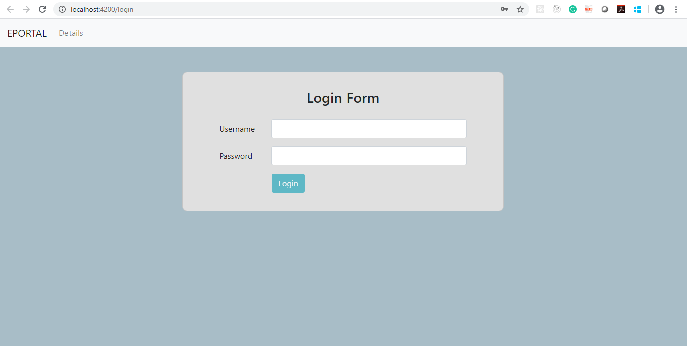
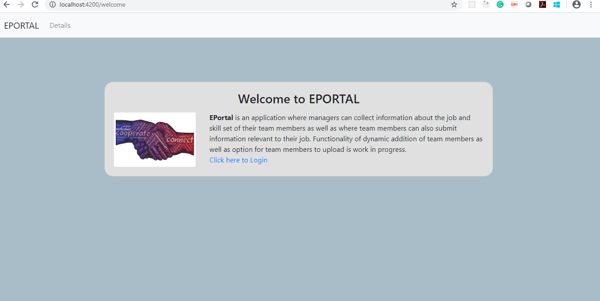
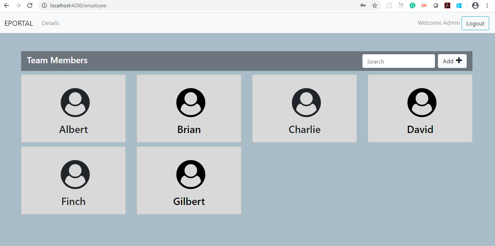
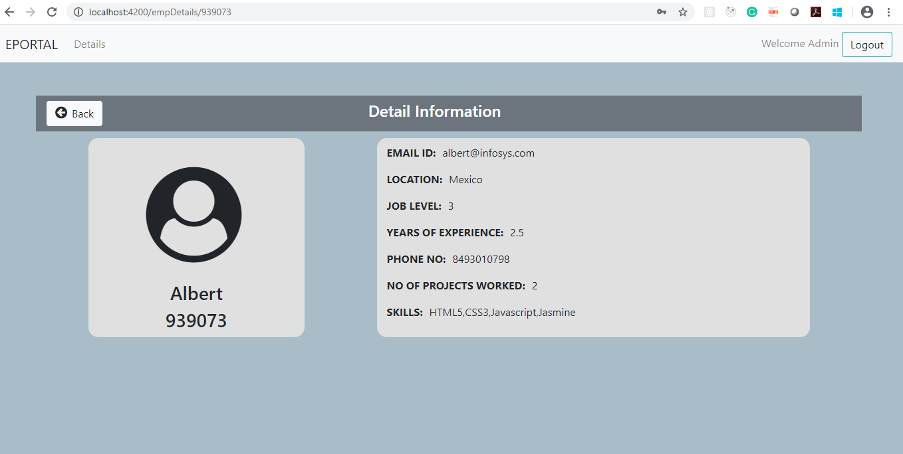
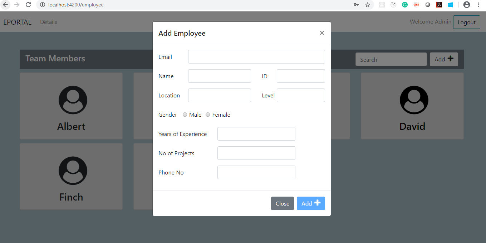

# [Angular: Beyond the Basics](https://lex.infosysapps.com/en/app/toc/lex_auth_0127668079785820163566/overview)

#### Angular is the most powerful UI framework which can be used to develop complex customizable, modern, responsive and user-friendly web applications. Angular framework follows a component-oriented application design pattern to develop completely reusable and modularized web applications. This course introduces learner various advanced topics of Angular like components deep dive, custom directives, custom pipes, custom form validators, RxJS and var...

---

### Capstone Projects: **EPortal Application - Problem Statement**

"EPortal" is an application where managers can collect information
about the job and skill set of their team members as well as where team
members can also submit information relevant to their job. Download [**CapstoneAngularProject.zip**](https://raw.githubusercontent.com/antillgrp/infy-eportal-angular/main/CapstoneAngularProject.zip). It contains two subfolders named **EP_UI** and **EPwebservice**.

* **EPwebservice** folder contains the implemented server-side code
* **EP_UI** folder contains the client-side code which needs to be implemented

**Software’s Required:**

1. Visual Studio Code
2. MongoDB
3. Node

## **PROJECT COFIGURATION AND SETUP**

EPwebservice contains the following **Fully Implemented** artifacts:

| Filename                            |
| ------------------------------------- 
| app.js                              | 
| public/javascripts/connections.js   |
| public/javascripts/ErrorLogger.js   |
| public/javascripts/Employee.js      |
| public/javascripts/Login.js         |
| public/javascripts/EmployeeDAL.js   |
| public/javascripts/LoginDAL.js      |
| public/javascripts/RequestLogger.js |
| Public/javascrips/Validator.js      |
| routes/routing.js                   |
| TableScript.txt                     |

### **Setting up MongoDB**

The MongoDB database named **EXAM_DB** (TableScript.txt) contains two collections as mentioned below:

* **UserCredentials** - UserCredentials collection contains the credential details of user with username and password.
* **Employees** – Employees collection contains the details of all the employees

a. Start the Mongo database server and the mongo terminal.

b. From the **EPWebservice** project copy the contents of **TableScript.txt** file. Right-click on the mongodb client and paste the content.

c. Your database is now ready to use.

**Running back end application (EPwebservice)**

Now run the application using the command:

```
$ sudo node app
```

On successful execution, you can see the following output in the terminal:

```
Your web service is running in on port 1020
```

## **Project Implementation (EPortal_UI):**

EPortal_UI contains the following artifacts:

|  **Components**          |  **Description**  |
| -------------------------------- | ------------------------- |
|  LoginComponent                | Partially Implemented   |
|  EmplistComponent              |
|  EmpdetailComponent            |
|  AddEmployeeComponent          |
|  WelcomeComponent              |
|  AppComponent                  |

**1.  LoginComponent:**

The below view must be displayed from LoginComponent. Navbar in the below view is from NavbarComponent.

Input fields will have validations as below.

| **Input Field** | **Validation**| **Message**|
| ----------------| --------------| -----------|
| username| required| Username is required |
| | minimum length| Username should be greater than 5 |
| | maximum length| Username should be lesser than 8  |
| password| required| Password is required |

On successful login, load EmplistComponent. Only logged in user can
view EmplistComponent and EmpDetailComponent. The below view must be
displayed from EmplistComponent and also update NavbarComponent.



**2. NavbarComponent and WelcomeComponent**

Navbar container 2 tabs, EPortal and Details. On selecting EPortal, load WelcomeComponent as displayed below.



Without logging in, by clicking on “**Click here to Login** ”, navigate to LoginComponent. **Hint:** Store login details with Behavior Subject of RxJS.

**3.  EmplistComponent**

On hover, view of each employee has to be as displayed below.



On clicking each employee card, display the details of that employee as mentioned below:

**4. EmpdetailComponent**



**5. AddEmployeeComponent**

On clicking **Add** button, load the modal dialog from AddEmployeeComponent.



Input fields should have the validations

|**Input Field**|**Validation**|**Message**|
| --------------| -------------| ----------|
|emailId|required|Please enter a valid Email ID|
|empName|required|Employee Name is required|
|empId|required|Employee ID is required|
|empLocation|required|Employee Location is required|
|jobLevel|required|Job Level is required|
||value should be between 3 and 8|Job Level should be between 3 & 8|
|gender|required|Gender is required|
|yearsOfExperience|required|Years of experience is required|
|noOfProjectsWorked|required|  No of projects worked is required  |
|phoneNo|required|Phone No is required|

**Hint: Use custom validators where ever necessary**

# [infy-eportal-angular](https://https://github.com/antillgrp/infy-eportal-angular)

This web app is a **Full Stack** (Front-End (client) <=> Back-End (servers)).

https://github.com/antillgrp/infy-eportal-angular/raw/main/assets/1111.mp4

Next points describe how was it done and what technologies were used:

- # Front-End

| Core |||| Auxiliar libraries and dependencies: |
| :--------------------- |-|-|-| :--- |
| TypeScript |||| bootstrap |
| **Angular** |||| @angular/form |
| **RxJS** |||| @angular/router|

### Instructions(webapp)

```
$ cd infy-eportal-angular/EP_UI/
$ npm start
```

- # Back-End

Back-End consist in a Node/Express (**REST APIs**),

### 1st server NodeJS:

- #### express (web server)
- #### mongo (mongodb driver for nodejs)

### Webservice Instructions:

\> cd swdv-620-web-apps-final-project/NodeServer

\> **npm start**

### Database Server Setup:

\> docker pull **mysql**

\> docker run --name mysql -p **3406**:3306 -e MYSQL_ROOT_PASSWORD=**mypassword** -d **mysql**

\> mysql -h **localhost** -P **3406** -u **root** -p **mypassword** < **customers.sql**

